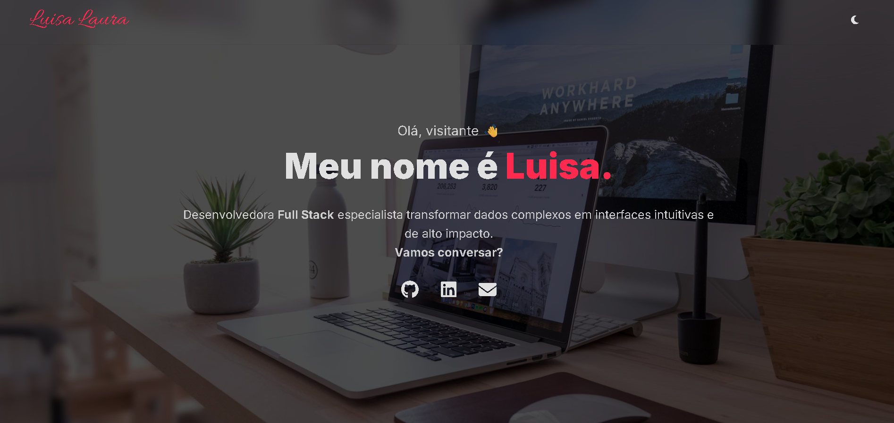

# 👩‍💻 Portfólio Profissional - Luisa Laura

 

> "Transformando dados complexos em interfaces intuitivas e de alto impacto."

## 📌 Sobre o Projeto

Este é o meu portfólio profissional desenvolvido para apresentar minhas habilidades como **Desenvolvedora Front-End**. O objetivo deste projeto é centralizar meus projetos acadêmicos e pessoais, certificações e experiências, com foco em uma interface moderna, responsiva e acessível.

O design foi pensado para transmitir profissionalismo com um toque de modernidade (temas Light/Dark), ideal para o setor bancário e corporativo.

---

## 🚀 Tecnologias Utilizadas

O projeto foi construído utilizando as melhores práticas de desenvolvimento web sem o uso de frameworks pesados, garantindo performance máxima:

* **HTML5** (Semântico e acessível)
* **CSS3** (Variáveis, Flexbox, Grid, Animações, Media Queries)
* **JavaScript (ES6+)** (Manipulação de DOM, Lógica de troca de temas)
* **Swiper.js** (Biblioteca para carrosséis interativos e responsivos)
* **Font Awesome** (Ícones vetoriais)
* **Google Fonts** (Tipografia Inter e Allura)

---

## ✨ Funcionalidades Destaque

* **🎨 Tema Light/Dark:** O site detecta a preferência do usuário e permite alternar entre modo claro e escuro, salvando a escolha no navegador.
* **📱 Totalmente Responsivo:** Adaptável para Celulares, Tablets e Desktops.
* **🔍 Efeitos Interativos:** Cards com efeito 3D (Tilt), Zoom em certificados e animações suaves.
* **📄 Carrossel de Certificados:** Visualização dinâmica das certificações com efeito de "Pop-up" para leitura.

---

## 🌐 Como ver o projeto

Você pode acessar o portfólio online através do GitHub Pages:

🔗 **[Clique aqui para acessar o Portfólio](https://luisa-collab.github.io/portfolio)**

---

## 📸 Preview

  

---

## 📞 Contato

Estou disponível para novas oportunidades e desafios na área de tecnologia.

* **LinkedIn:** [Luisa Laura](http://www.linkedin.com/in/luisa-laura-a94634346)
* **Email:** luisa.laura.envio@gmail.com
* **GitHub:** [@luisa-collab](https://github.com/luisa-collab)

---

Desenvolvido com 💙 por **Luisa Laura**.